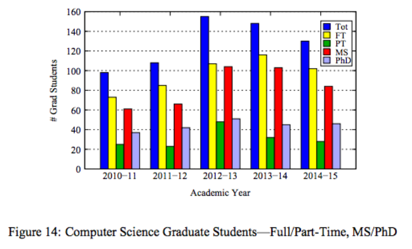
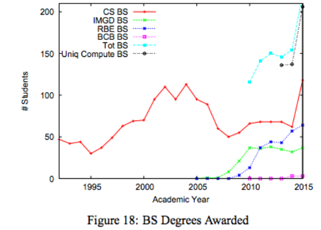

# Lab -- Making a Slopechart

Link: [http://cs573-16f.github.io/lab-slopechart/index.html](http://cs573-16f.github.io/lab-slopechart/index.html)

Team:

- Lane Harrison, codementum
- Hane Larrison, modecentum

Slopecharts are incredibly useful for comparing multiple values across two points in time.

Few people are aware of slopecharts, however, and instead use more familiar charts like bars or lines.

Your assignment is to take one of the charts below and, using d3, re-code it into a slopechart.
(These charts are from an actual WPI report, and could use some work :wink:)
Feel free to approximate the data from the chart.

You *do not* have to show every year. The most recent two is fine, but feel free to try more if you're up to the challenge.

Also feel free to experiment with interaction, color, size, or any of the visual channels we discussed in class.

